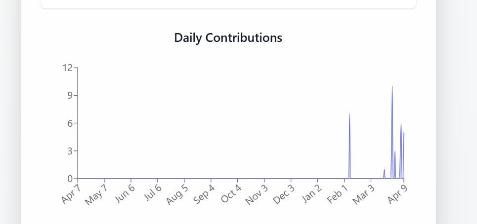

# 📝 GitHub Activity Tracker

Track GitHub users' public repositories and contribution activity with a clean and responsive UI.

🔗 **Live Demo**: [github-activity-tracker-tan.vercel.app](https://github-activity-tracker-tan.vercel.app/)

---

## 📸 Preview

### 🔍 Repository List


### 📈 Contribution Graph



---

## ⚙️ Setup Instructions

### 1. Clone the Repository

```bash
git clone https://github.com/yourusername/github-activity-tracker.git
cd github-activity-tracker
```

### 2. Install Dependencies

```bash
npm install
```

### 3. Create `.env` File

Create a `.env` file in the root of the project with the following content:

```env
VITE_GITHUB_TOKEN=your_github_personal_access_token
```

> 🔐 **Note:** This GitHub token is required to authenticate requests. You can create one from [https://github.com/settings/tokens](https://github.com/settings/tokens) with at least `public_repo` scope.

### 4. Run Locally

```bash
npm run dev
```

The app will be available at `http://localhost:5173/` by default.

---

## 🚢 Deployment

To deploy on platforms like **Vercel**, **Netlify**, or **Render**:

1. Make sure to include your `.env` variable:
   ```env
   VITE_GITHUB_TOKEN=your_github_personal_access_token
   ```
   > These platforms allow you to set environment variables in their dashboard.

2. Build the project:

   ```bash
   npm run build
   ```

3. Deploy the `dist/` folder.

---

## 🚀 Features

- 🔍 Search any GitHub username
- 📂 List all public repositories with description
- 📈 Display daily contribution chart
- ⚡ Super-fast performance using Vite
- 🎨 UI powered by ShadCN + TailwindCSS
- 🔐 Token-based GitHub API access

---

## 🧰 Tech Stack

- **React** – Frontend framework  
- **Vite** – Lightning-fast dev/build tool  
- **TypeScript** – Static typing  
- **TailwindCSS** – Utility-first CSS  
- **ShadCN UI** – Beautiful pre-built components  
- **Recharts** – Charting library for contributions  
- **GitHub REST API** – For user & repo data  

---

## 🤝 Contributing

Pull requests and feedback are always welcome! If you have any suggestions or want to improve something, go for it 🚀

---


Made with by **Nayan Acharya**
